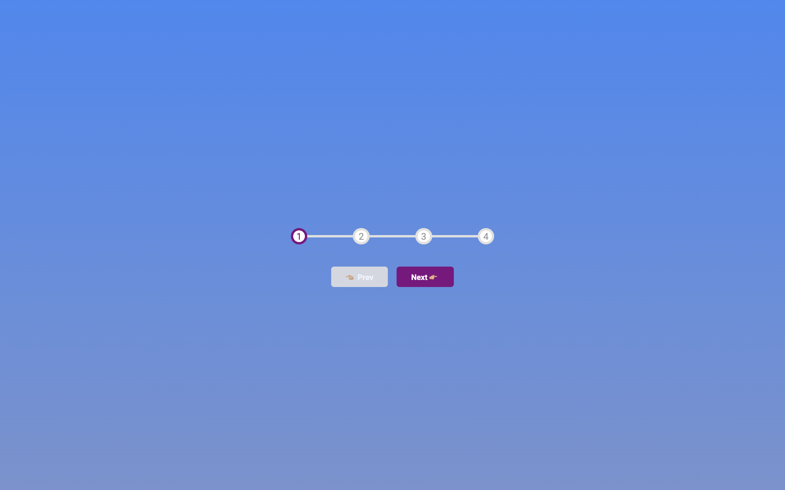

# Progress Steps 🏃🏻

This project it's a progress bar. A lot of websites use it with forms, shopping to see the progression of the carts, with multilevels forms etc...

We will create two buttons **'Next'** and **'Prev'**. with this we'll progress one by one until final step.
Of course in the first step the button **Prev** must be disabled and for the last steps **Next** button 'll be it.

