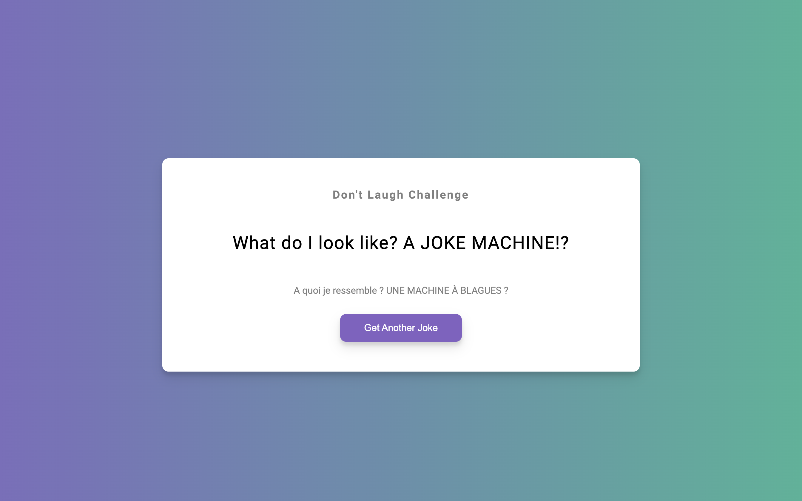

# Dad Jokes

I'm going to be building joke application where it gives us a joke.
They're just Carambar Jokes and we can click a button to get a new joke with a translation in french.

For this project we'll use APIs from https://icanhazdadjoke.com/api for the Jokes and https://www.deepl.com/docs-api for the translation.

For the API [Dad Joke](https://icanhazdadjoke.com/api) no need key api just set the 'header:{}' with {'Accept: 'apllication/json'}.
However [Deepl api](https://www.deepl.com/docs-api) need a auth key, just regiser for free to have got 500_000 characters per month.

